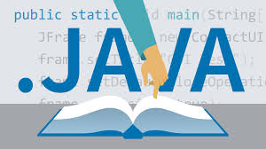
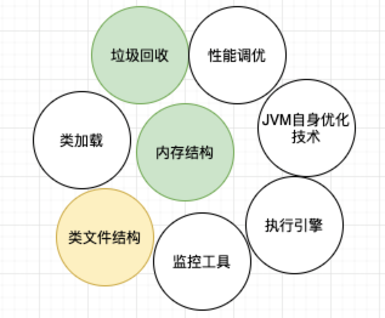

# Superman

> Superman是什么：构建Java 高级开发技术的知识体系，Java项目最佳实践，从基础不断打怪升级成为超人之路。编程基础、JVM深度剖析、并发编程、 Spring全家桶、高并发、分布式、高性能存储、性能调优、容器化、微服务。只要你掌握这些知识就可以成为Java界的Superman。

👍 推荐阅读: 所有文章都整理在了语雀:https://www.yuque.com/jakeprim/java 可直接从语雀查看.

| 技术专题                                           | 状态       | 历史记录        |
| -------------------------------------------------- | ---------- | --------------- |
| 编程基础功 [:computer:](#编程基础功-computer)      | [写作中]   | Java基础完成    |
| 数据结构与算法 [:pencil2:](#算法-pencil2)          | [写作中]   | 重新整理        |
| 设计模式 [:trophy:](#设计模式-trophy)              | [敬请期待] |                 |
| JavaWeb 核心技术                                   | [已完成]   | JavaWeb基础完成 |
| 深入剖析JVM [:alien:](#深入剖析JVM-alien)          | [写作中]   | JVM底层原理     |
| 并发编程成神之路 [:two_hearts:](#并发编程成神之路) | [写作中]   | 线程的本质      |
| 网络编程和Netty[:collision:](#网络编程和Netty)     | [敬请期待] |                 |
| 剖析Mybatis框架源码 [:notes:](#剖析MyBatis源码)    | [写作中]   |                 |
| 剖析Spring系列框架源码 [:dash:](#剖析Spring源码)   | [写作中]   |                 |

| 技术专题                          | 状态     | 历史记录 |
| --------------------------------- | -------- | -------- |
| **分布式架构设计**                | [未开启] |          |
| **分布式消息服务中间件**          | [未开启] |          |
| **微服务深入剖析**                | [未开启] |          |
| **分布式系统缓存与存储系统架构**  | [未开启] |          |
| **分布式架构性能调优**            | [未开启] |          |
| **容器虚拟化技术和自动化部署**    | [未开启] |          |
| **分布式搜索引擎进阶**            | [未开启] |          |
| **面试专题**                      | [未开启] |          |
| **海量数据存储/计算(大数据扩展)** | [未开启] |          |

## 读书 :arrow_forward:

| Book | 状态 | 原创/转载 |
| --- | --- | --- |
| 《深入理解Java虚拟机》 | 在读中 ||

## 编程基础功 :computer:

### 计算机原理

### 网络协议

### 操作系统

- [Linux基础](https://www.yuque.com/jakeprim/java/ufs57p)

### Java核心技术

- [Java 面向对象](https://www.yuque.com/jakeprim/java/ir64h7)
- [Java核心类库-上](https://www.yuque.com/jakeprim/java/lgpglx)
- [Java核心类库-下](https://www.yuque.com/jakeprim/java/uhqr16)

## 数据结构与算法 :pencil2:

## 设计模式 :trophy:

## 分布式系统缓存与存储系统架构

### MySQL 数据库

- [新-SQL基础](https://www.yuque.com/jakeprim/java/hrxd7f)
- [新-JDBC技术](https://www.yuque.com/jakeprim/java/img0c6)
- [MySQL 数据类型](https://www.yuque.com/jakeprim/java/li66dt)
- [MySQL 数据管理](https://www.yuque.com/jakeprim/java/sqehlt)
- [MySQL 常用函数](https://www.yuque.com/jakeprim/java/ldm0hf)
- **[JDBC Java连接数据库](https://www.yuque.com/jakeprim/java/xiixmo)**  JDBC[示例代码](https://github.com/JakePrim/Awesome-Java-Notebook/tree/master/JDBC)
- [事务管理-同时修改两个表多次获取连接的问题](https://www.yuque.com/jakeprim/java/lk3iud)
- [JavaWeb 连接数据库实战](https://www.yuque.com/jakeprim/java/lk3iud)

### Redis

## JavaWeb 核心技术

- [JavaWeb核心技术(Servlet和Jsp)](https://www.yuque.com/jakeprim/java/owtxpn)
- [JavaWeb 核心技术(Filter和Listener)](https://www.yuque.com/jakeprim/java/wngwk9)
- [XML 入门](https://www.yuque.com/jakeprim/java/ocaeai)

- **[Servlet 入门](https://www.yuque.com/jakeprim/java/acho42)** 
-  [JSP 入门](https://www.yuque.com/jakeprim/java/vntgg4)
-  **[Servlet与JSP进阶](https://www.yuque.com/jakeprim/java/dp9dyv)**  
-  **[EL表达式与JSTL](https://www.yuque.com/jakeprim/java/idbuft)** 
-  [Servlet 与JSP实战](https://www.yuque.com/jakeprim/java/dx2rsh)
-  [JSON 的使用](https://www.yuque.com/jakeprim/java/kb8xp3)
-  **[正则表达式](https://www.yuque.com/jakeprim/java/glqiu7)** 
- **[过滤器 - Filter](https://www.yuque.com/jakeprim/java/rmyr2g)** 
-  **[监听器 - Listener](https://www.yuque.com/jakeprim/java/ku7a0l)** 
-  **[文件上传](https://www.yuque.com/jakeprim/java/vz06g3)**  
-  [JavaWeb 项目实战](https://www.yuque.com/jakeprim/java/kzr1w5)
## 深入剖析JVM :alien:

- [JVM基础及内存区域](https://www.yuque.com/jakeprim/java/hs50zz) 
-  [深入理解JVM内存区域](https://www.yuque.com/jakeprim/java/qhmxou) 
-  [JVM中的对象及引用](https://www.yuque.com/jakeprim/java/dg1z8m) 
-  [垃圾回收算法](https://www.yuque.com/jakeprim/java/gu7k43)
- [JVM底层实现细节](https://www.yuque.com/jakeprim/java/ka5oxt)

## 并发编程成神之路 :two_hearts:

- [聊一聊Java线程的本质](https://www.yuque.com/jakeprim/java/czmz1g) 
- [线程核心基础1](https://www.yuque.com/jakeprim/java/vlov3e)
-  [线程核心基础2](https://www.yuque.com/jakeprim/java/nnaan1)

## 网络编程和Netty:collision:

## 剖析MyBatis源码 :notes:

### MyBatis 快速入门

- [Maven入门](https://www.yuque.com/jakeprim/java/no7s2e)
-  **[MyBatis 入门](https://www.yuque.com/jakeprim/java/xuog0h)**
- [MyBatis 高级特性](https://www.yuque.com/jakeprim/java/og1ahc)
- [MyBatis技术整理 - 推荐](https://www.yuque.com/jakeprim/java/dg0m08)

### MyBatis 原理剖析 【必看】

- [持久层框架设计]()

## 剖析Spring源码 :dash:

### Spring 快速入门及实战

- [Spring IOC](https://www.yuque.com/jakeprim/java/npehcf)
- [Spring AOP](https://www.yuque.com/jakeprim/java/gwo9az)
- [JdbcTemplate&事务&Web集成](https://www.yuque.com/jakeprim/java/ugr9yq)
- [Spring MVC](https://www.yuque.com/jakeprim/java/gei0w1)
- [SSM框架整合](https://www.yuque.com/jakeprim/java/niolov)
- [Maven聚合工程](https://www.yuque.com/jakeprim/java/hpqzy6)
- [SSM 单体架构实战-常见需求实现](https://www.yuque.com/jakeprim/java/wszo0g)

### 全面掌握Spring核心原理【必看】

### Spring MVC 原理实现 【必看】

### SpringBoot的运行原理和自定义Starter 【必看】

### SpringSecurity源码剖析【选看】

### SpringWebFlux源码剖析【选看】

## 分布式架构性能调优

### Nginx

- [Nginx快速入门](https://www.yuque.com/jakeprim/java/gl87gi)

## 分布式架构设计

### Zookeeper

- [Zookeeper快速入门](https://www.yuque.com/jakeprim/java/ib5c4n)

### Dubbo

- [Dubbo快速入门](https://www.yuque.com/jakeprim/java/eh4w3w)

## 微服务深入剖析